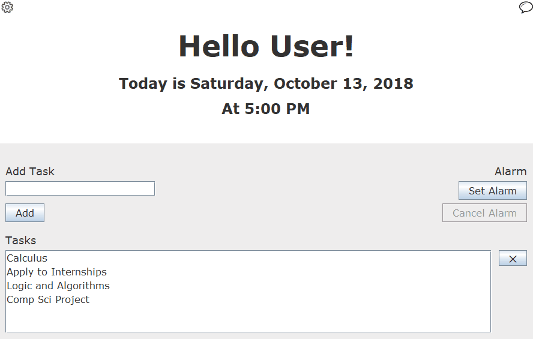
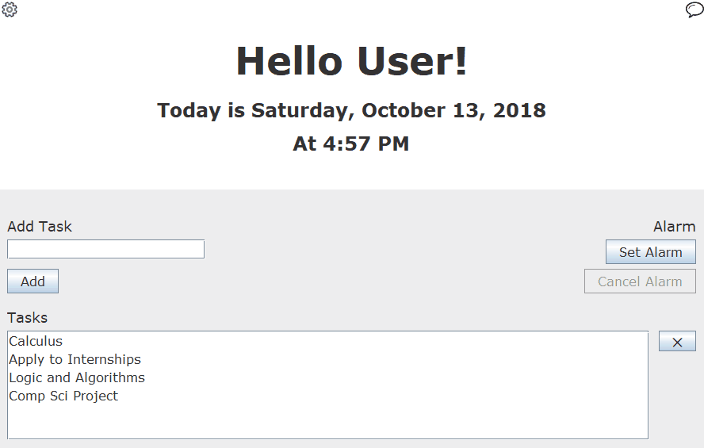

# Advanced-To-Do-List-and-Timer
Java graphical user interface application that keeps track of tasks and has a build-in timer. It is a NetBeans project and uses [jsoup](https://jsoup.org/).

## Tasks
Keeps track of tasks you have to do. You can add and remove tasks. 

## Alarm
You can set an alarm. When the alarm goes off a sound will play until you stop it.

## Options
You can set persistent options. The program saves your name and color.

## Options
You can pull an inspirational quote from the internet. Hitting the reload button changes the quote.

